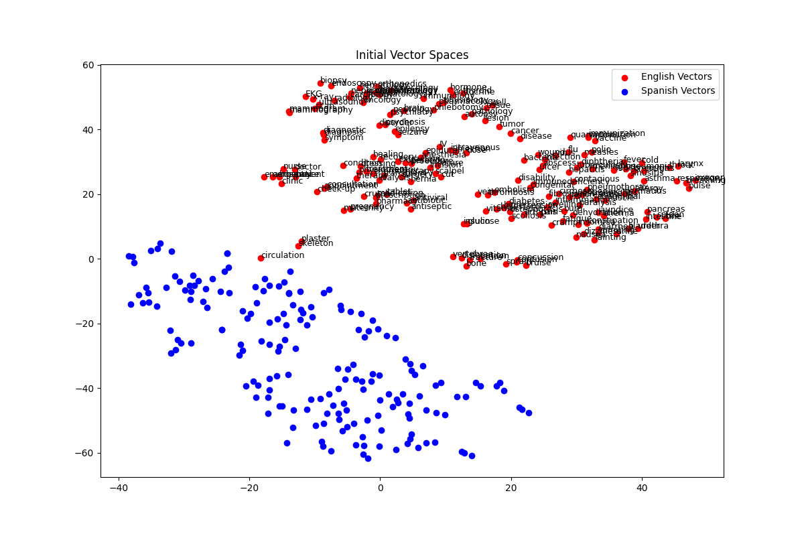
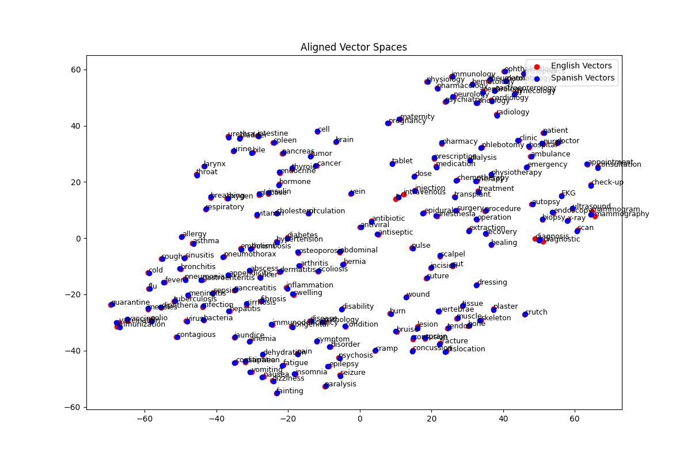

# Medical Terminology Translation Improvement using Word Embeddings

## Introduction

This project aims to enhance the translation accuracy of medical terminology between English and Spanish by leveraging word embeddings. Accurate medical translations are crucial for patient care, and current tools like bilingual dictionaries and Google Translate often fall short. Our approach uses advanced alignment techniques to map vector spaces of English and Spanish, leading to more contextually accurate translations.

The project involves:

- Loading pre-trained FastText word embeddings for English and Spanish.
- Using a bilingual dictionary to train a mapping between the English and Spanish vector spaces.
- Applying orthogonal Procrustes alignment to improve the translation quality.
- Evaluating translation accuracy using BLEU scores.

## Motivation

Medical translations require precision to avoid misunderstandings that could impact patient care. Traditional bilingual dictionaries require constant updates, which is time-consuming and impractical. Tools like Google Translate often produce translations that, while technically correct, are not commonly used by native speakers. For example, Google Translate might translate "stroke" as "ataque" (attack), which is vague and potentially misleading. Our method correctly translates it as "infarto," a more precise term in medical contexts.

## Installation

To run this project, ensure you have Python 3.11 or lower installed. Follow the steps below to set up the environment:

1. Clone this repository:

   ```bash
   git clone https://github.com/yourusername/medical-translation-improvement.git
   cd medical-translation-improvement
   ```

2. Create a virtual environment and activate it:

   ```bash
   python -m venv venv
   source venv/bin/activate  # On Windows, use `venv\Scripts\activate`
   ```

3. Install the required dependencies:

   ```bash
   pip install -r requirements.txt
   ```

4. Download the necessary FastText models:
   ```python
   import fasttext.util
   fasttext.util.download_model('en', if_exists='ignore')
   fasttext.util.download_model('es', if_exists='ignore')
   ```

## Usage

1. Ensure the word embedding models (`cc.en.300.bin` and `cc.es.300.bin`) are in the project directory.

2. Run the script to align word embeddings and evaluate translations:

   ```bash
   python3.11 main.py
   ```

3. The script will output BLEU scores for different translation methods and save visualizations of the word embeddings.

## Visualizations

### Word Embeddings Before Alignment



### Word Embeddings After Alignment



## Project Structure

- `main.py`: Main script to run the translation improvement process.
- `requirements.txt`: List of dependencies required for the project.
- `initial_vector_spaces.png`: Visualization of word embeddings before alignment.
- `aligned_vector_spaces.png`: Visualization of word embeddings after alignment.

## Evaluation

The project evaluates translation accuracy using BLEU scores. Three methods are compared:

- **Dictionary Lookup**: Using a predefined bilingual dictionary.
- **Google Translate**: Using the Google Translator API.
- **Improved Method**: Using the aligned word embeddings.

## Results

The average BLEU scores for the different translation methods are displayed at the end of the script execution. Our findings indicate that the improved method using aligned word embeddings significantly enhances translation accuracy, ensuring better communication in medical contexts.

## Future Work

Future work could involve using domain-specific word embeddings and refining the alignment techniques to further enhance translation accuracy and ensure a better future for our patients.

## Contributing

Contributions are welcome! Please open an issue or submit a pull request for any improvements or suggestions.

## License

This project is licensed under the MIT License.

## Contact

For any inquiries, please contact Roberto Lozano at [rlozano2@scu.edu](mailto:rlozano2@scu.edu).

---

### Note

- Ensure that the `.gz` files are decompressed to obtain the `.bin` files for the FastText models.
- This project was developed in Python 3.11 and may not be compatible with Python 3.12 and above.
